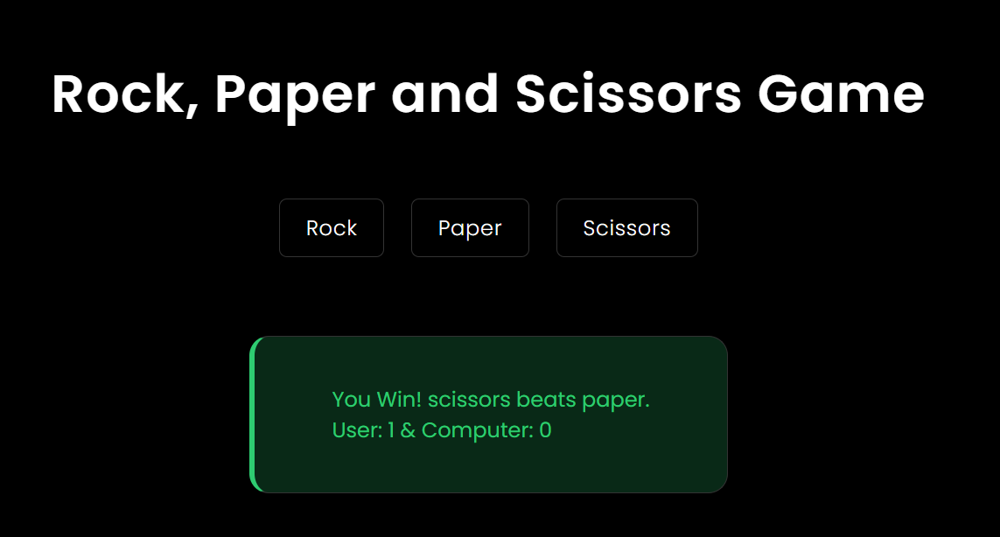
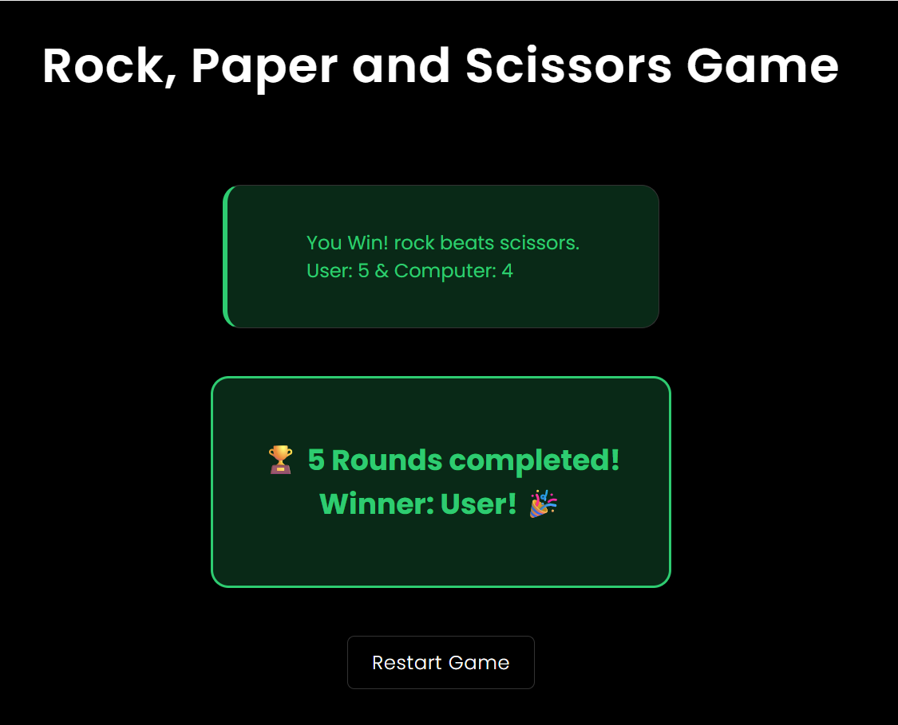

# Rock Paper Scissors - Interactive Web Game

This is a modern implementation of the classic **Rock, Paper, Scissors** game built with JavaScript, HTML, and CSS as part of the **Odin Project - Foundations Curriculum**.

The game features a **sleek dark theme UI** with interactive buttons, dynamic result displays, and smooth animations for an engaging user experience.

---

## 🚀 Features

- **Interactive UI**: Click buttons to make your choice instead of console prompts
- **Dark Theme**: Elegant black background with minimal design
- **Real-time Score Tracking**: Live score updates after each round
- **Dynamic Result Display**: Color-coded results (Green for wins, Red for losses, Yellow for ties)
- **Responsive Design**: Works on desktop and mobile devices
- **Smooth Animations**: Subtle transitions and hover effects
- **Game State Management**: Proper game flow from start to finish
- **Restart Functionality**: Easy game restart with a single click

---

## 🔗 Live Demo

[Click here to play the game](https://piyushb-27.github.io/rock-paper-scissors/)

## 📸 Screenshot

---

## 🧠 Concepts Used

### **JavaScript Core Concepts:**
- **Functions** and function calls
- **Event Handling** (`addEventListener`)
- **Event Delegation** (using `event.target.id`)
- **DOM Manipulation** (`createElement`, `appendChild`, `innerHTML`)
- **DOM Selectors** (`querySelector`, `getElementById`)
- **Conditionals** (`if-else` statements)
- **Loops** and iteration
- **Switch statements**
- **Random number generation** (`Math.random()`)
- **Array/Object manipulation**
- **Variable scope** (global vs local)

### **DOM & UI Concepts:**
- **Dynamic HTML Creation** (creating elements with JavaScript)
- **CSS Class Manipulation** (`classList.add`, `classList.remove`)
- **Element Styling** (dynamic style changes)
- **Event-driven Programming**
- **State Management** (tracking game state)
- **Conditional Rendering** (showing/hiding elements)

### **CSS & Design Concepts:**
- **CSS Grid/Flexbox** for layout
- **CSS Transitions** and animations
- **Hover Effects** and interactive states
- **Responsive Design** with media queries
- **CSS Custom Properties** and theming
- **Typography** and font styling
- **Color Theory** (dark theme implementation)
- **Box Model** and spacing

---
